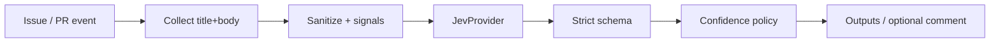

# JEV Model Navigator

GitHub Action that uses [TypeSafe Jev](https://vercel.com/ai-gateway/models/jev) to **select which AI model** should handle an **Issue or Pull Request** task.

It returns stable outputs (`selected_model`, `provider`, `confidence`, `reason_codes`, `decision`). By default it runs in **`decision_only`** mode: recommend only, do not invoke the selected model.

> **Note:** `provider` in the outputs is the **selected model’s vendor** (e.g. `openai`). It is **not** the Jev access provider (`jev_provider`).

## Quick Start

```yaml
name: Model Navigator
on:
  issues:
    types: [opened, edited]
  pull_request:
    types: [opened, edited, synchronize]

permissions:
  contents: read
  issues: write
  pull-requests: write

jobs:
  navigate:
    runs-on: ubuntu-latest
    steps:
      - uses: actions/checkout@v4
      - id: nav
        uses: JevForge/jev-model-navigator@v0.4.0
        env:
          AI_GATEWAY_API_KEY: ${{ secrets.AI_GATEWAY_API_KEY }}
        with:
          jev_provider: vercel-ai-gateway
          model_catalog_path: .jev/model-catalog.yml
          decision_only: 'true'
          include_pr_diff: 'true'
          apply_labels: 'true'
          create_check_run: 'true'
          comment_on_github: 'true'
      - run: echo "${{ steps.nav.outputs.selected_model }} / ${{ steps.nav.outputs.alternate_model }}"
```

Pin `@v0.4.0` for reproducibility, or `@v0` for the floating major.

Marketplace: [JEV Model Navigator](https://github.com/marketplace/actions/jev-model-navigator)

## How it works



1. Collect task text from the Issue/PR (or `task` input).
2. Load candidates from `candidates` input, `.jev/config.yml`, or `model_catalog_path`.
3. Call Jev through the configured **`jev_provider`** (no silent fallback).
4. Validate the answer against an allowlist + Zod schema.
5. Apply `low_confidence_policy`.
6. Emit outputs; optionally comment. Never execute free-form model text as a command.

## Architecture

| Layer | Responsibility |
|---|---|
| Collectors | Issue/PR payload, `.jev/config.yml`, model catalog |
| `JevProvider` | `vercel-ai-gateway` / `typesafe-native` / `custom-compatible` |
| Decision policy | Allowlist, confidence, fail/warn/request-review/no-op |
| Executors | Optional GitHub comment; `ModelRunner` stub for future invoke |

For `vercel-ai-gateway`, Jev is called with AI SDK `experimental_evaluate` and model `typesafe-ai/jev` (not `generateText`).

## Inputs

| Input | Default | Notes |
|---|---|---|
| `task` | Issue/PR body | Optional override |
| `candidates` | — | JSON array; else catalog/config |
| `model_catalog_path` | `.jev/model-catalog.yml` | YAML catalog |
| `min_confidence` | `0.7` | 0–1 |
| `decision_only` | `true` | Skip model invoke |
| `low_confidence_policy` | `fail` | `fail` \| `warn` \| `request-review` \| `no-op` |
| `jev_provider` | `vercel-ai-gateway` | Jev access provider |
| `jev_endpoint` | — | Required for `custom-compatible` |
| `jev_model` | — | Required for native/custom; Gateway uses `typesafe-ai/jev` |
| `budget_preference` | `balanced` | `cheapest` \| `balanced` \| `best_quality` |
| `timeout_ms` | `45000` | |
| `comment_on_github` | `false` | Needs `issues: write` / `pull-requests: write` |
| `dry_run` | `false` | Skip mutating writes |
| `github_token` | `${{ github.token }}` | For comments |

## Outputs

| Output | Description |
|---|---|
| `selected_model` | Candidate id or empty |
| `provider` | Selected **model** provider |
| `alternate_model` | Fallback candidate id (never equals selected) |
| `ranked_models` | JSON `[selected, alternate]` |
| `confidence` | 0–1 |
| `reason_codes` | JSON string array |
| `decision` | `SELECT_MODEL` \| `ABSTAIN` \| `REQUEST_REVIEW` |
| `explanation` | Display only |
| `provisional` | `true` if Jev was unavailable |
| `summary` | One-line log summary |

## Jev providers

| `jev_provider` | Credential | Notes |
|---|---|---|
| `vercel-ai-gateway` | `AI_GATEWAY_API_KEY` | Default; `experimental_evaluate` + `typesafe-ai/jev` |
| `typesafe-native` | `TYPESAFE_API_KEY` | Requires pinned `jev_model` |
| `custom-compatible` | `JEV_CUSTOM_API_KEY` | Requires HTTPS `jev_endpoint` + `jev_model` |

Configuration may also live in `.jev/config.yml` (see `examples/jev-config.yml`). Input values override file values. **No silent fallback between providers.**

## Data Sent to JEV

Only:
- sanitized Issue/PR task text (truncated, secrets redacted)
- derived task signals (booleans / token estimate)
- optional PR diff **metadata** when `include_pr_diff` is true: file paths, languages, additions/deletions, sensitive/test/infra flags (never patch hunks)
- candidate metadata (id, provider, capabilities, context, cost tier, availability)
- budget preference and confidence constraints

Never: GitHub tokens, API keys, raw patch hunks, checkout blobs, or unrelated secrets.

## Permissions

Minimum for outputs-only:

```yaml
permissions:
  contents: read
```

With comments, labels, and check runs:

```yaml
permissions:
  contents: read
  issues: write
  pull-requests: write
  checks: write
```

## Valid / invalid decisions

**Valid**

```json
{
  "decision": "SELECT_MODEL",
  "selected_model": "openai-gpt-5-5",
  "provider": "openai",
  "confidence": 0.86,
  "reason_codes": ["CANDIDATE_BEST_MATCH", "CODE_GENERATION_FIT"],
  "provisional": false
}
```

**Rejected by schema / allowlist**
- `selected_model` not in candidates
- `confidence` outside 0..1
- unknown `reason_codes`
- `SELECT_MODEL` with `selected_model: null`
- `ABSTAIN` with a selected model set
- treating `jev_provider` as the selected model provider

## Organizational batch planner (optional CLI)

Local planning aid for the 30 JevForge Actions (fixtures in this repo only — not coupled to any other local lab):

```bash
npm run batch:plan
```

Writes `examples/responses/*.json`. Without Jev credentials, responses are marked `provisional: true` and never invent model IDs outside the catalog.

## Development

```bash
npm install
npm test
npm run typecheck
npm run build
```

Consumers run `dist/index.js` (`runs.using: node24`); they do not need to install dependencies.

## Security

See [SECURITY.md](SECURITY.md). Issue/PR text is untrusted. Jev free-form text is never executed.

## License

MIT
