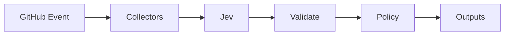

# JEV Model Navigator

[](https://github.com/JevForge/jev-model-navigator/releases)
[](LICENSE)
[](https://github.com/marketplace/actions/jev-model-navigator)
[](https://github.com/JevForge/jev-model-navigator/actions/workflows/ci.yml)

**Route Issues and Pull Requests to the right AI model** using [TypeSafe Jev](https://vercel.com/ai-gateway/models/jev) as a typed decision layer inside GitHub Actions.

Teams often hard-code a single model for every task. This Action collects Issue/PR context (and optional compact PR file metadata), asks Jev to choose from an allowlisted catalog, then returns stable outputs your workflow can branch on—without invoking the selected model by default.

```yaml
- id: nav
  uses: JevForge/jev-model-navigator@v0.4.0
  env:
    AI_GATEWAY_API_KEY: ${{ secrets.AI_GATEWAY_API_KEY }}
  with:
    model_catalog_path: .jev/model-catalog.yml
```

> **Note:** Output `provider` is the **selected model vendor** (for example `openai`). It is **not** `jev_provider` (how this Action reaches Jev).

## Features

* Typed model routing powered by Jev (`experimental_evaluate`, not free-form generation)
* Secret-based authentication (`AI_GATEWAY_API_KEY`, `TYPESAFE_API_KEY`, or `JEV_CUSTOM_API_KEY`)
* Structured outputs for later workflow steps (`selected_model`, `decision`, `confidence`, …)
* Optional PR diff metadata (paths and line counts only—never patch hunks)
* Optional Issue/PR comments, managed `jev:*` labels, and Check Runs
* Deterministic allowlist + schema validation; Jev prose is never executed
* Configurable low-confidence policy: `fail` | `warn` | `request-review` | `no-op`

## How it works

```text
Issue / Pull Request
        ↓
Collect title, body, optional PR file metadata
        ↓
Sanitize + derive task signals
        ↓
Jev evaluates allowlisted candidates
        ↓
Schema + confidence policy
        ↓
Action outputs (+ optional comment / labels / check)
        ↓
Next CI/CD step
```



1. Read task text from the Issue/PR (or `task` input).
2. Load candidates from `candidates`, `.jev/config.yml`, or `model_catalog_path`.
3. Call Jev through `jev_provider` (no silent provider fallback).
4. Validate against an allowlist and schema; optionally ask for `alternate_model`.
5. Apply `low_confidence_policy`.
6. Emit outputs. Free-form explanation text is display-only.

## Demo

```text
Pull Request: "Refactor auth middleware"
        ↓
Diff signals: TypeScript + auth/ paths, +120/-40
        ↓
Jev → selected_model = openai-gpt-5-5
      alternate_model = google-gemini-3-5-flash
      decision = SELECT_MODEL
      confidence = 0.86
        ↓
Downstream job routes the coding agent to GPT-5.5
```

## Quick Start

1. Copy [`examples/model-catalog.yml`](examples/model-catalog.yml) to `.jev/model-catalog.yml` in your consumer repo.
2. Add repository secret `AI_GATEWAY_API_KEY` (default provider).
3. Add a workflow:

```yaml
name: Model Navigator
on:
  issues:
    types: [opened, edited]
  pull_request:
    types: [opened, edited, synchronize]

permissions:
  contents: read
  issues: write
  pull-requests: write
  checks: write

jobs:
  navigate:
    runs-on: ubuntu-latest
    steps:
      - uses: actions/checkout@v4

      - id: nav
        uses: JevForge/jev-model-navigator@v0.4.0
        env:
          AI_GATEWAY_API_KEY: ${{ secrets.AI_GATEWAY_API_KEY }}
        with:
          model_catalog_path: .jev/model-catalog.yml
          decision_only: 'true'
          include_pr_diff: 'true'
          create_check_run: 'true'

      - name: Use recommendation
        run: |
          echo "decision=${{ steps.nav.outputs.decision }}"
          echo "model=${{ steps.nav.outputs.selected_model }}"
          echo "fallback=${{ steps.nav.outputs.alternate_model }}"
```

Pin `@v0.4.0` for reproducibility, or `@v0` for the floating major line.

Marketplace listing: [JEV Model Navigator](https://github.com/marketplace/actions/jev-model-navigator)

## Complete Example

See [`examples/workflows/model-navigator.yml`](examples/workflows/model-navigator.yml) and:

* [`examples/basic.yml`](examples/basic.yml) — minimal outputs-only run
* [`examples/pr.yml`](examples/pr.yml) — PR with diff signals + Check Run
* [`examples/gate.yml`](examples/gate.yml) — branch later steps on `decision`

## Inputs

| Input | Required | Default | Description |
| ----- | -------- | ------- | ----------- |
| `task` | no | Issue/PR title+body | Optional task override |
| `candidates` | no | — | JSON array of candidates; else catalog/config |
| `model_catalog_path` | no | `.jev/model-catalog.yml` | Catalog path relative to workspace |
| `min_confidence` | no | `0.7` | Minimum confidence for `SELECT_MODEL` |
| `decision_only` | no | `true` | Recommend only; do not invoke the model |
| `low_confidence_policy` | no | `fail` | `fail` \| `warn` \| `request-review` \| `no-op` |
| `jev_provider` | no | `vercel-ai-gateway` | Jev access provider |
| `jev_endpoint` | no | — | HTTPS endpoint for native/custom |
| `jev_model` | no | — | Required for native/custom; Gateway uses `typesafe-ai/jev` |
| `budget_preference` | no | `balanced` | `cheapest` \| `balanced` \| `best_quality` |
| `timeout_ms` | no | `45000` | Jev timeout |
| `comment_on_github` | no | `false` | Post summary comment |
| `apply_labels` | no | `false` | Apply managed `jev:*` labels |
| `create_check_run` | no | `true` | Create Check Run on head SHA |
| `dry_run` | no | `false` | Skip mutating GitHub writes |
| `include_pr_diff` | no | `true` | Collect compact PR file metadata |
| `github_token` | no | `${{ github.token }}` | For files/comments/labels/checks |

## Outputs

| Output | Description |
| ------ | ----------- |
| `selected_model` | Selected candidate id, or empty |
| `provider` | Selected **model** vendor |
| `alternate_model` | Fallback candidate id (never equals selected) |
| `ranked_models` | JSON `[selected, alternate]` |
| `confidence` | `0`–`1` |
| `reason_codes` | JSON array of stable reason codes |
| `decision` | `SELECT_MODEL` \| `ABSTAIN` \| `REQUEST_REVIEW` |
| `explanation` | Display-only text |
| `provisional` | `true` if Jev was unavailable |
| `summary` | One-line log summary |
| `diff_file_count` | PR files summarized (when collected) |
| `diff_languages` | JSON language list from paths |
| `label_status` | `applied` \| `dry-run` \| `skipped` |
| `check_status` | `created` \| `dry-run` \| `skipped` |

### Using outputs in conditions

```yaml
- name: Continue with selected model
  if: steps.nav.outputs.decision == 'SELECT_MODEL'
  run: echo "Use ${{ steps.nav.outputs.selected_model }}"

- name: Request human review
  if: steps.nav.outputs.decision == 'REQUEST_REVIEW'
  run: echo "Navigator asked for review"

- name: Fail closed on abstain
  if: steps.nav.outputs.decision == 'ABSTAIN'
  run: |
    echo "No safe candidate"
    exit 1
```

## Authentication

Create a repository secret:

```text
Repository → Settings → Secrets and variables → Actions → New repository secret
```

| `jev_provider` | Secret name | Notes |
| -------------- | ----------- | ----- |
| `vercel-ai-gateway` (default) | `AI_GATEWAY_API_KEY` | AI SDK `experimental_evaluate` + `typesafe-ai/jev` |
| `typesafe-native` | `TYPESAFE_API_KEY` | Requires pinned `jev_model` |
| `custom-compatible` | `JEV_CUSTOM_API_KEY` | Requires HTTPS `jev_endpoint` + `jev_model` |

**Never** put API keys in workflow YAML, logs, or Issues. There is **no silent fallback** between providers.

Optional local config: [`.jev/config.yml`](examples/jev-config.yml) (inputs override file values).

## Why JEV?

Jev is TypeSafe’s evaluation model for **structured decisions**, not chat. This Action needs a choice from an allowlist of model ids, confidence, and optional abstain/review signals. Jev returns typed answers (`choice` / `boolean`) that code can validate. Generative text would be unsafe to treat as a command or model id. That is why the Action uses `experimental_evaluate` and never `generateText` for the decision.

## Data Sent to JEV

Only:

* sanitized Issue/PR task text (truncated; secrets redacted)
* derived task signals
* optional PR diff **metadata** (paths, languages, +/- counts, sensitive/test/infra flags)
* candidate metadata (id, provider, capabilities, context, cost tier, availability)
* budget preference and confidence constraints

Never: GitHub tokens, API keys, patch hunks, or unrelated checkout blobs.

## Permissions

Outputs only:

```yaml
permissions:
  contents: read
```

Comments, labels, Check Runs, and PR file listing:

```yaml
permissions:
  contents: read
  issues: write
  pull-requests: write
  checks: write
```

## Versioning

```yaml
uses: JevForge/jev-model-navigator@v0.4.0   # recommended pin
uses: JevForge/jev-model-navigator@v0       # floating major (v0.x)
```

See [CHANGELOG.md](CHANGELOG.md) and [Releases](https://github.com/JevForge/jev-model-navigator/releases).

## Development

Requires Node.js 24+.

```bash
npm install
npm test
npm run typecheck
npm run build
```

Consumers run bundled `dist/index.js` (`runs.using: node24`) and do not need to install dependencies.

Optional local planner CLI (fixtures in this repo):

```bash
npm run batch:plan
```

## Contributing

See [CONTRIBUTING.md](CONTRIBUTING.md). Report bugs via Issues—**never** include API keys or tokens.

## Security

See [SECURITY.md](SECURITY.md).

## License

[MIT](LICENSE)
